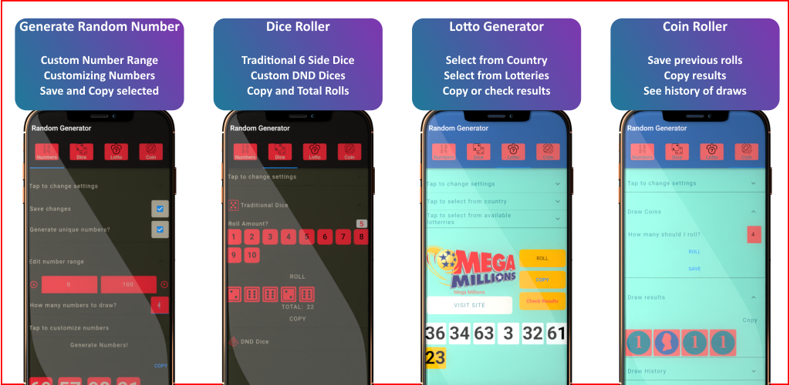

Welcome to RandomGen, the all-in-one mobile application that brings excitement, fun, and convenience to your fingertips! Whether you need to generate random numbers, make crucial decisions with a coin toss, test your luck with lottery guessing, or roll dice for your favorite tabletop adventures, RandomGen has got you covered!

https://play.google.com/store/apps/details?id=com.bindortyuzyirmibir.random

Key Features:

1. Random Number Generator
Unleash the power of randomness with our robust random number generator. Simply set your desired number range, and RandomGen will deliver a truly unpredictable number with just a tap. Whether you're picking lottery numbers, raffle winners, or making random selections, this tool is a game-changer!

2. Coin Toss Functionality
Can't decide between two choices? Leave it to chance! Our coin-toss functionality lets you flip a virtual coin to get a quick and fair decision. Perfect for settling debates, making spontaneous choices, or adding an element of surprise to your day!

3. Lottery Guessing Game
Feeling lucky? Test your intuition and see if you can guess the winning numbers for various lotteries around the world. RandomGen's lottery guessing game lets you playfully predict lottery outcomes and might just make you the next jackpot winner!

4. Dice Roller
Calling all tabletop gamers! Whether you play traditional board games or delve into thrilling RPG adventures, our dice roller supports both standard 6-sided dice and customizable Dungeons & Dragons (D&D) dice. Experience realistic rolls with stunning 3D dice graphics!

5. Customization Options
Tailor RandomGen to suit your preferences. Choose from a range of themes and layouts to personalize your experience. Adjust the sound effects or opt for silent rolls—make RandomGen truly yours!

6. User-Friendly Interface
We believe that simplicity leads to joy. RandomGen's intuitive and user-friendly interface ensures that everyone can access its powerful features effortlessly.

7. Offline Functionality
No internet? No problem! RandomGen works seamlessly offline, so you can rely on it anytime, anywhere.

8. Privacy and Security
We value your privacy. RandomGen does not collect any personal data, ensuring a secure and anonymous experience for all users.

Get RandomGen now and embrace the magic of randomness in the palm of your hand! Let chance guide your decisions, spark your imagination, and bring more excitement to your daily life. Download RandomGen today and let the adventure begin!
